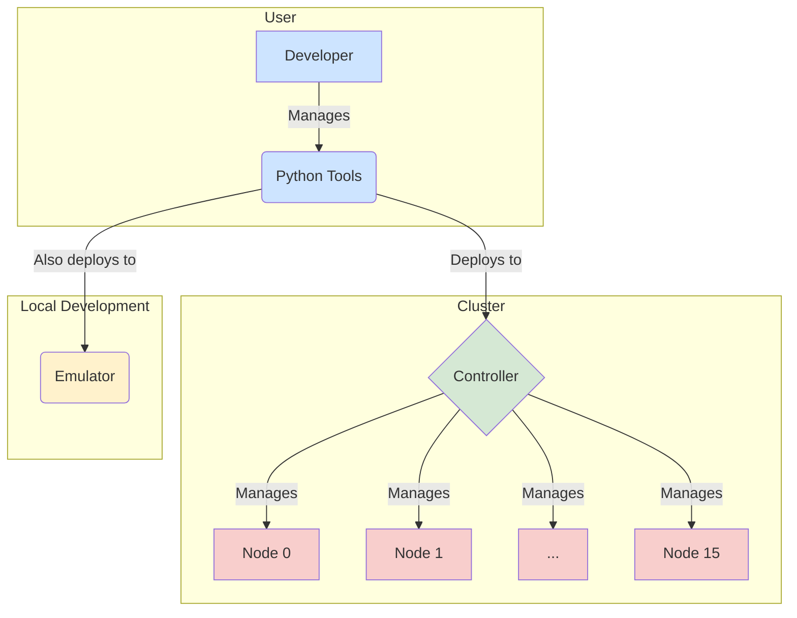

# NeuroFab Z1 Code Walkthrough

**A Developer-Friendly Guide to the NeuroFab Z1 Neuromorphic System**

Welcome to the NeuroFab Z1 codebase! This guide is designed to walk you through the entire system, from the high-level architecture down to the individual lines of code. Whether you're a seasoned SNN expert or a curious developer, this document will provide the context and clarity you need to understand, modify, and extend the NeuroFab Z1 platform.

---

## Part 1: A Gentle Introduction to Spiking Neural Networks (SNNs)

Before we dive into the code, let's build a simple, intuitive understanding of what a Spiking Neural Network (SNN) is. Forget the complex math for a moment; let's think about it with some common-sense analogies.

### What is a Spiking Neuron?

Imagine a neuron is like a small bucket with a tiny hole in the bottom. 

*   **Water Drops (Input):** Other neurons send information to this bucket in the form of discrete water drops. These drops are called **spikes**.
*   **Filling the Bucket (Membrane Potential):** As drops fall into the bucket, the water level rises. This water level is the neuron's **membrane potential**. It represents the neuron's accumulated energy or excitement.
*   **The Leaky Hole (Leak Rate):** The bucket is always slowly leaking. If no new drops come in, the water level will gradually go down. This prevents the neuron from staying excited forever.
*   **The Tipping Point (Threshold):** The bucket has a "full" line. If the water level reaches this line, the bucket tips over and empties all its water in one big splash. This splash is the neuron's own **spike**.
*   **The Reset (Refractory Period):** After tipping over, the bucket needs a moment to set itself back up. During this brief period, it can't collect any new water drops. This is the **refractory period**.

In short, a spiking neuron is a simple unit that collects input (spikes), accumulates it (membrane potential), and fires its own spike when it reaches a certain threshold, then resets.

| SNN Term | Analogy | Description |
|---|---|---|
| **Neuron** | A leaky bucket | The basic processing unit. |
| **Spike** | A water drop | A discrete event, a piece of information. |
| **Membrane Potential** | Water level in the bucket | The neuron's internal energy or excitement. |
| **Threshold** | The "full" line on the bucket | The point at which the neuron fires. |
| **Leak Rate** | The hole in the bucket | The gradual decay of the neuron's potential. |
| **Refractory Period** | Resetting the bucket | A brief period after firing when the neuron is inactive. |

### What is a Synapse?

A synapse is the connection *between* two neurons. It determines how a spike from one neuron affects another.

Imagine the water drop (spike) from one bucket doesn't fall directly into the next. Instead, it goes through a special tap.

*   **The Tap (Synapse):** This tap can change the size of the water drop. 
*   **Excitatory Synapse (Positive Weight):** The tap can make the drop bigger. A single spike from the first neuron results in a larger amount of water being added to the next neuron's bucket, making it more likely to fire. This is a **positive weight**.
*   **Inhibitory Synapse (Negative Weight):** The tap can be a sponge that *removes* water from the next bucket. A spike from the first neuron causes the second neuron's water level to *decrease*, making it less likely to fire. This is a **negative weight**.

So, a **synapse** is just a weighted connection. It's a volume knob that controls how much influence one neuron has on another.

### How Does an SNN Compute?

Unlike traditional neural networks that process continuous numbers in one big pass, SNNs process information over **time**. The computation happens through the patterns of spikes.

Think of it like a complex chain reaction of tipping buckets. 

1.  **Input:** You start by dropping water into a few "input" buckets.
2.  **Propagation:** These buckets might tip over, sending their own spikes (splashes) to other buckets through the synapse taps.
3.  **Pattern Recognition:** Some buckets might only tip if they receive drops from two specific buckets at the same time (like an AND gate). Others might tip if they receive a drop from *either* of two buckets (like an OR gate).
4.  **Output:** You watch a specific "output" bucket. If it tips over, that's a "1". If it doesn't, that's a "0".

By carefully setting the bucket sizes, leak rates, and tap weights, you can build a network that recognizes specific temporal patterns of spikes and performs complex computations, like the XOR example we'll see later.

### Why Are SNNs Interesting?

1.  **Energy Efficiency:** Neurons only do work when they send or receive a spike. If there's no activity, there's no power consumption. This is very different from traditional AI, where all neurons are active all the time. This makes SNNs ideal for low-power hardware.
2.  **Temporal Information:** SNNs are naturally good at processing information that changes over time, like audio, video, or sensor data, because spikes themselves are time-based events.

Now that we have a mental model of what an SNN is, let's look at how the NeuroFab Z1 system is designed to run them.

---

## Part 2: System Architecture Overview

The NeuroFab Z1 system is designed as a scalable, multi-node cluster for running SNNs. It consists of three main parts:

1.  **Hardware:** The physical Z1 nodes and the controller that manages them.
2.  **Python Tools:** A suite of command-line tools for deploying, managing, and interacting with the cluster.
3.  **Emulator:** A software-based emulator that mimics the hardware, allowing for local development and testing without physical hardware.

### High-Level Diagram



### Key Components

| Component | Location | Description |
|---|---|---|
| **Controller** | `embedded_firmware/controller/` | The central brain of the cluster. It receives commands from the Python tools and manages the compute nodes. |
| **Compute Node** | `embedded_firmware/node/` | The workhorse. Each node runs a small SNN engine and can host thousands of neurons. |
| **Bootloader** | `embedded_firmware/bootloader/` | Runs on each node and is responsible for flashing new firmware. |
| **Python Tools** | `python_tools/` | The user-facing command-line interface (CLI) for the cluster. |
| **Emulator** | `emulator/` | A Python-based simulation of the hardware cluster for local development. |

### The Three Layers of the Codebase

It helps to think of the codebase in three distinct layers:

1.  **Hardware Firmware (C):** This is the low-level C code that runs directly on the microcontrollers. It includes the controller, the node SNN engine, and the bootloader. This code is all about performance and direct hardware control.
    *   **Location:** `embedded_firmware/`

2.  **Deployment & Management Tools (Python):** This is the high-level Python code that you, the developer, will interact with. It includes the `nsnn` tool for deploying networks, `nflash` for flashing firmware, and `nls` for listing nodes. This code is about user experience and managing the cluster.
    *   **Location:** `python_tools/`

3.  **Emulation & Testing (Python):** This is a Python-based replica of the hardware. It allows you to test your SNNs and your interactions with the cluster without needing any physical hardware. It's designed to be functionally identical to the hardware.
    *   **Location:** `emulator/`

Now, let's dive into each of these layers, starting with the hardware firmware.

---

## Part 3: Hardware Firmware Walkthrough

The hardware firmware is the heart of the NeuroFab Z1 system. It's written in C for maximum performance and runs directly on the microcontrollers. Let's break down the key components.

### 1. The Controller (`embedded_firmware/controller/`)

The controller is the master of the cluster. It acts as a bridge between the user (via the Python tools) and the compute nodes.

#### Key Files:

*   `z1_controller.c`: The main entry point for the controller. It initializes the hardware and starts the HTTP API server.
*   `z1_http_api.c`: This is where the web server is implemented. It defines all the API endpoints that the Python tools use to communicate with the controller.

#### Code Highlights: `z1_http_api.c`

This file is critical. It defines how the outside world talks to the cluster. Let's look at a typical endpoint:

```c
// Example from z1_http_api.c

// Handler for GET /api/cluster/status
static void handle_cluster_status(struct mg_connection *nc, int ev, void *ev_data) {
    if (ev == MG_EV_HTTP_REQUEST) {
        // ... (code to gather status from all nodes)
        
        // Send response as JSON
        mg_printf(nc, "HTTP/1.1 200 OK\r\n"
                      "Content-Type: application/json\r\n\r\n");
        mg_printf(nc, "{ \"status\": \"ok\", \"nodes\": %d }", node_count);
    }
}
```

When you run `nls` (node list) from the Python tools, it sends an HTTP request to this endpoint. The controller then gathers the information and sends back a JSON response. This is the fundamental communication pattern for the entire system.

### 2. The Compute Node (`embedded_firmware/node/`)

This is where the real SNN computation happens. Each node runs an instance of the SNN engine.

#### Key Files:

*   `z1_node.c`: The main entry point for a compute node. It initializes the SNN engine and waits for commands from the controller.
*   `z1_snn_engine.c`: The SNN engine itself. This is where the neuron and synapse logic is implemented.
*   `z1_snn_engine.h`: The header file that defines the data structures for neurons and synapses.

#### Code Highlights: `z1_snn_engine.h` - The Neuron in Memory

This header file defines how a neuron is represented in memory. This is the C equivalent of our "leaky bucket" analogy.

```c
// From z1_snn_engine.h

typedef struct {
    uint16_t id;                    // Local ID on this node
    uint16_t flags;                 // e.g., is it an input neuron?
    float membrane_potential;       // Current water level
    float threshold;                // The "full" line
    float leak_rate;                // How fast the bucket leaks
    uint32_t last_spike_time;       // When it last fired
    uint32_t refractory_period_us;  // How long to reset
} z1_neuron_runtime_t;
```

This `struct` is the blueprint for every neuron running on the hardware. When the SNN engine runs, it's essentially just looping through an array of these `z1_neuron_runtime_t` structs and updating their `membrane_potential` based on incoming spikes.

#### Code Highlights: `z1_snn_engine.c` - The Simulation Loop

This file contains the core logic of the SNN simulation. The `z1_snn_engine_run()` function (or similar) will contain a loop that does the following for every neuron:

1.  **Apply Leak:** Decrease the `membrane_potential` by the `leak_rate`.
2.  **Process Incoming Spikes:** Check for incoming spikes for this neuron. For each spike, find the corresponding synapse and add its weight to the `membrane_potential`.
3.  **Check for Firing:** If `membrane_potential >= threshold`, then:
    *   The neuron has fired! Send a spike to the controller.
    *   Reset `membrane_potential` to 0.
    *   Start the `refractory_period`.

This loop, running thousands of times per second, is what brings the SNN to life.

### 3. The Bootloader (`embedded_firmware/bootloader/`)

The bootloader is a small, separate program that runs when a node first powers on. Its only job is to allow for firmware updates.

#### Key Files:

*   `z1_bootloader.c`: Contains the logic for receiving new firmware from the controller and writing it to the node's flash memory.

#### How Flashing Works:

1.  The `nflash` Python tool sends the new firmware to the controller.
2.  The controller sends a special command to the target node, telling it to reboot into bootloader mode.
3.  The node reboots and starts the `z1_bootloader.c` program.
4.  The controller sends the new firmware to the bootloader.
5.  The bootloader writes the firmware to the flash memory.
6.  The node reboots again, this time loading the new firmware.

This process allows for remote updates of the entire cluster without needing physical access to the nodes.

Next, we'll look at the Python tools that you'll use to interact with this firmware.

---

## Part 4: Python Tools Walkthrough

The Python tools are your command center for the NeuroFab Z1 cluster. They provide a user-friendly command-line interface (CLI) for all management and deployment tasks. All the tools are located in `python_tools/bin/` and share a common library in `python_tools/lib/`.

### 1. The Core Libraries (`python_tools/lib/`)

This directory contains the shared logic that all the tools use.

#### Key Files:

*   `z1_client.py`: This is the Python client that communicates with the controller's HTTP API. It has methods like `deploy_snn()`, `start_snn()`, `get_spike_events()`, etc. Every tool that talks to the cluster uses this client.
*   `cluster_config.py`: This is the brilliant configuration management library we just fixed. It handles loading the cluster configuration from files and environment variables, providing a unified way for all tools to know which controller to talk to.
*   `snn_compiler.py`: This is the SNN compiler. It takes a high-level JSON description of a neural network and compiles it into the binary format that the hardware (and emulator) understands.

#### Code Highlights: `snn_compiler.py` - From JSON to Binary

This is where the magic happens. You define your network in a simple JSON file, and this compiler turns it into a `neuron_table.bin` file that can be loaded onto the nodes.

Let's look at the process:

1.  **Parse JSON:** The compiler reads your `xor.json` file, which defines layers of neurons and their connections.
2.  **Assign Neurons to Nodes:** It intelligently distributes the neurons across the available nodes in the cluster.
3.  **Pack Neuron Data:** For each neuron, it packs the data (threshold, leak rate, etc.) into a 256-byte binary format, exactly as defined in the `z1_snn_engine.h` header file. This is a crucial step that must match the hardware perfectly.
4.  **Pack Synapse Data:** It then packs the synapse data, converting the weights and source neuron IDs into the compact 4-byte format.
5.  **Generate Binary File:** The final output is a binary file containing all the neuron and synapse data, ready to be loaded onto a node.

This compiler is what allows you to work with a high-level, human-readable format (JSON) while the hardware runs a highly optimized, low-level binary format.

### 2. The Command-Line Tools (`python_tools/bin/`)

These are the executable Python scripts that you run from your terminal.

| Tool | Description |
|---|---|
| `nsnn` | **SNN Management:** Deploy, start, stop, and monitor SNNs. |
| `nflash` | **Firmware Flashing:** Upload new firmware to nodes. |
| `nls` | **List Nodes:** Show the status of all nodes in the cluster. |
| `nping` | **Ping a Node:** Send a test message to a specific node. |
| `nstat` | **Node Statistics:** Get detailed statistics from a node. |
| `ncp` | **Memory Copy:** Write data to a specific memory address on a node. |
| `ncat` | **Memory Read:** Read data from a specific memory address on a node. |
| `nconfig` | **Cluster Configuration:** Manage the `cluster.json` file. |

#### Code Highlights: `nsnn` - A Typical Tool

The `nsnn` tool is a great example of how all the tools work.

1.  **Argument Parsing:** It uses `argparse` to define the commands it accepts (`deploy`, `start`, etc.) and the arguments for each.
2.  **Configuration Loading:** It uses `ClusterConfig` to determine which controller to talk to. This is where our recent fix was so important - it now correctly prioritizes environment variables.
3.  **Client Interaction:** It creates an instance of `Z1Client` and calls the appropriate method. For example, `nsnn deploy` will call `client.deploy_snn()`.
4.  **User Feedback:** It prints status messages to the console to let the user know what's happening.

By sharing the `z1_client.py` and `cluster_config.py` libraries, all the tools have a consistent and reliable way of interacting with the cluster.

Next, we'll see how you can run this entire system on your local machine with the emulator.

---

## Part 5: Emulator Walkthrough

The emulator is a software simulation of the entire NeuroFab Z1 hardware cluster. It allows you to develop and test your SNNs on your local machine without needing any physical hardware. It's designed to be a drop-in replacement for the real hardware.

**Location:** `emulator/`

### How it Works

The emulator runs a Python-based web server that mimics the controller's HTTP API. When you run the Python tools, you can point them at the emulator instead of the real hardware by setting environment variables:

```bash
export Z1_CONTROLLER_IP=127.0.0.1
export Z1_CONTROLLER_PORT=8000

# Now all tools will talk to the emulator
nsnn deploy my_network.json
```

### Key Files

*   `z1_emulator.py`: The main entry point for the emulator. It starts the API server and creates the simulated cluster.
*   `core/api_server.py`: This is the implementation of the controller's HTTP API in Python. It has the same endpoints as the C version (`z1_http_api.c`), but instead of talking to real hardware, it talks to the simulated nodes.
*   `core/cluster.py`: Manages the collection of simulated nodes.
*   `core/node.py`: A Python class that simulates a single Z1 compute node. It has a memory space and can load neuron tables.
*   `core/snn_engine.py`: A Python implementation of the SNN engine. This is a pure Python version of the C code in `embedded_firmware/node/z1_snn_engine.c`.

### Code Highlights: `core/snn_engine.py` - The Python SNN Engine

This file is a Python replica of the hardware SNN engine. It has the same core logic:

1.  **Neuron Class:** A Python class to represent a neuron, with attributes for `membrane_potential`, `threshold`, etc.
2.  **Simulation Loop:** A `run()` method that contains the main simulation loop, just like the C version.
3.  **Spike Processing:** Logic to handle incoming spikes and update neuron potentials.

This is where we fixed the spontaneous activity bug. The original code had a section that made input neurons fire automatically, which we removed. This highlights the importance of the emulator: we were able to find and fix a critical bug in a controlled software environment before it ever became a problem on hardware.

### The Development Workflow

The intended workflow for a developer is:

1.  **Develop Locally:** Write your SNN model in JSON.
2.  **Test with Emulator:** Start the emulator and use the Python tools to deploy and test your network. Debug any issues with the network topology or parameters.
3.  **Deploy to Hardware:** Once you're confident your network is working correctly, change the environment variables to point to the real hardware and deploy it.

This workflow allows for rapid iteration and testing without the need for constant access to physical hardware.

Next, let's look at some examples of how to use the system.

---

## Part 6: Examples and Usage Guide

Now let's put it all together and see how to use the system with a practical example: the XOR network.

**Location:** `python_tools/examples/`

### 1. The XOR Example (`xor_4of4.json`)

This file is a JSON description of an SNN that solves the XOR problem. It's a great example of how to define a network.

```json
// A simplified view of xor_4of4.json
{
    "layers": [
        {
            "name": "input",
            "neurons": 2
        },
        {
            "name": "hidden_or",
            "neurons": 1,
            "neuron_params": {"threshold": 0.8}
        },
        {
            "name": "hidden_and",
            "neurons": 1,
            "neuron_params": {"threshold": 1.8}
        },
        {
            "name": "output",
            "neurons": 1,
            "neuron_params": {"threshold": 1.5}
        }
    ],
    "connections": [
        // Connections from input to hidden layers
        {
            "from": "input", "to": "hidden_or", "weight": 1.6
        },
        {
            "from": "input", "to": "hidden_and", "weight": 1.0
        },
        // Connections from hidden to output
        {
            "from": "hidden_or", "to": "output", "weight": 1.6
        },
        {
            "from": "hidden_and", "to": "output", "weight": -2.5
        }
    ]
}
```

This defines a 4-layer network:
- **Input Layer:** 2 neurons (for A and B)
- **Hidden OR Layer:** 1 neuron that fires if *either* A or B is active.
- **Hidden AND Layer:** 1 neuron that fires only if *both* A and B are active.
- **Output Layer:** 1 neuron that gets excited by the OR gate and inhibited by the AND gate. The result is XOR!

### 2. Step-by-Step: Running the XOR Example

Here’s how you would test this network from start to finish.

#### Step 1: Start the Emulator

First, open a terminal and start the emulator. This will be our virtual hardware.

```bash
cd /home/ubuntu/neurofab_z1_cluster/emulator
python3 z1_emulator.py
```

You should see output indicating the emulator has started and is listening on port 8000.

#### Step 2: Set Environment Variables

Next, open a **new terminal**. In this terminal, tell the Python tools to talk to the emulator.

```bash
export Z1_CONTROLLER_IP=127.0.0.1
export Z1_CONTROLLER_PORT=8000
```

Now, any `n...` command you run in this terminal will be sent to the emulator.

#### Step 3: Deploy the SNN

Use the `nsnn` tool to compile and deploy the XOR network.

```bash
cd /home/ubuntu/neurofab_z1_cluster/python_tools/bin
./nsnn deploy ../examples/xor_4of4.json
```

This command will:
1.  Invoke the `snn_compiler.py` to create `xor_4of4.bin`.
2.  Use `z1_client.py` to send this binary to the emulator.
3.  The emulator will load the neuron table into its simulated nodes.

#### Step 4: Run the Test

Now, run the test script that injects spikes and checks the output.

```bash
cd /home/ubuntu
python3 test_xor_final.py
```

This script will:
1.  Connect to the emulator.
2.  For each XOR case (0,0), (0,1), (1,0), (1,1):
    a. Reset the network.
    b. Inject input spikes (e.g., for (0,1), inject a spike into neuron 1).
    c. Start the SNN execution.
    d. Wait a short period.
    e. Read the spike events from the output neuron.
    f. Check if the result is correct.

You should see the output indicating that all 4 cases pass!

### What You've Learned

By following these steps, you have:
- ✅ Defined an SNN in a high-level JSON format.
- ✅ Compiled it into a hardware-compatible binary.
- ✅ Deployed it to a (simulated) neuromorphic cluster.
- ✅ Injected input spikes to drive the computation.
- ✅ Read the output spikes to get the result.

This is the complete end-to-end workflow for the NeuroFab Z1 system. You now have the knowledge to modify the existing network, create your own, and test it on the emulator.

---

## Conclusion

This guide has provided a comprehensive tour of the NeuroFab Z1 codebase. We've covered:

- **SNN Concepts:** The basic principles of spiking neural networks, explained with simple analogies.
- **System Architecture:** The high-level design of the hardware, software, and emulator.
- **Hardware Firmware:** The low-level C code that runs the cluster.
- **Python Tools:** The user-friendly CLI for managing the system.
- **Emulator:** The software simulation that enables local development.
- **XOR Example:** A step-by-step guide to running a real SNN on the platform.

You are now equipped with the knowledge to explore the codebase on your own. Whether your goal is to design new SNNs, extend the hardware capabilities, or add new features to the tools, you have a solid foundation to build upon.

Happy spiking!
