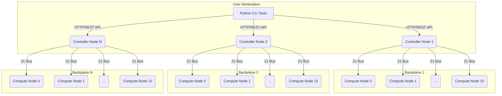

# NeuroFab Z1 System Integration Guide

**Author:** NeuroFab  
**Date:** November 11, 2025

## 1. Introduction

This document provides a comprehensive technical overview of the NeuroFab Z1 neuromorphic cluster system. It is intended for developers, system architects, and advanced users who wish to understand the inner workings of the hardware, firmware, and software components and how they integrate to deliver a massively parallel, distributed SNN platform.

## 2. High-Level Architecture

The Z1 system is a hierarchical, distributed architecture composed of three primary layers: the **User-Facing Tools**, the **Controller Nodes**, and the **Compute Nodes**. This design allows for high scalability, from a single backplane with 16 nodes to a large cluster with dozens of backplanes and thousands of nodes.

| Layer                 | Components                                      | Primary Function                                     | Communication Protocol |
| --------------------- | ----------------------------------------------- | ---------------------------------------------------- | ---------------------- |
| **User Tools**        | Python CLI (`nls`, `nsnn`, `nconfig`, etc.)     | User interaction, SNN compilation, cluster management | HTTP/REST API          |
| **Controller Node**   | RP2350B + W5500, HTTP Server Firmware          | API endpoint handling, bus master, spike routing     | Z1 Bus Protocol        |
| **Compute Node**      | RP2350B + 8MB PSRAM, SNN Engine Firmware       | Neuron simulation, spike processing, memory storage  | Z1 Bus Protocol        |



## 3. Component Deep Dive

### 3.1. Python CLI Tools

The Python tools provide the primary user interface to the cluster. They are designed to be modular, scriptable, and easy to use, following Unix design principles.

-   **`nconfig`**: Manages the cluster configuration file (`~/.neurofab/cluster.json`), allowing users to define multiple backplanes with their respective controller IPs.
-   **`nls`**: Lists nodes across one or all backplanes. Uses parallel HTTP requests for fast, cluster-wide status checks.
-   **`nsnn`**: The core SNN management utility. It integrates the SNN compiler and the API client to provide a seamless workflow for deploying, running, and monitoring networks.
-   **`ncp` / `ncat`**: Low-level utilities for direct memory access on compute nodes, essential for debugging and verification.

### 3.2. SNN Compiler (`snn_compiler.py`)

The compiler is the brain of the SNN deployment process. It transforms a high-level, abstract network definition into a concrete, low-level binary format ready for the hardware.

**Key Responsibilities:**

1.  **Neuron-to-Node Assignment**: Implements `balanced` and `layer_based` strategies to distribute neurons across all available nodes in the cluster configuration. This is critical for load balancing and maximizing parallelism.
2.  **Global ID Mapping**: Creates and maintains a map of every neuron's `global_id` to its physical location: `(backplane_id, node_id, local_id)`. This map is essential for routing spikes correctly.
3.  **Synapse Generation**: Populates the synapse tables for each neuron based on the `connections` defined in the topology. It converts high-level connection types (e.g., `fully_connected`) into specific `(source_global_id, weight)` pairs.
4.  **Binary Table Compilation**: Packs each neuron's configuration and its synapse list into a 256-byte binary structure, which is the exact format expected by the node firmware.
5.  **Deployment Plan Generation**: Outputs a `DeploymentPlan` object containing the compiled binary tables and all necessary mapping information for the `nsnn` utility to execute the deployment.

### 3.3. Controller Firmware (`z1_http_api.c`)

The controller firmware acts as the bridge between the high-level world of HTTP/JSON and the low-level, real-time world of the Z1 hardware bus.

**Key Components:**

-   **HTTP Server**: A lightweight web server (built on `lwip`) that listens on port 80 for API requests.
-   **API Endpoint Handlers**: Functions that parse incoming JSON, validate parameters, and translate API calls into Z1 bus commands.
-   **Z1 Bus Master**: The controller is the sole master of the 16-bit parallel Z1 bus. It initiates all communication with the compute nodes.
-   **Spike Routing Logic**: (Future enhancement) A planned component to handle inter-node and inter-backplane spike forwarding. Currently, spikes are broadcast on the bus.

### 3.4. Compute Node Firmware (`z1_snn_engine.c`)

The node firmware is where the core neuromorphic computation occurs. It is optimized for real-time performance and efficient memory access.

**Key Components:**

-   **Z1 Bus Slave**: The node firmware listens for commands from the controller on the Z1 bus.
-   **Command Dispatcher**: A `switch` statement in the main loop that handles incoming commands like `Z1_CMD_MEMORY_WRITE`, `Z1_CMD_SNN_START`, etc.
-   **SNN Engine**: A set of functions (`z1_snn_init`, `z1_snn_step`, `z1_snn_process_spike`) that implement the LIF neuron model.
-   **PSRAM Access**: The firmware directly accesses the 8MB external PSRAM to read the neuron table and update neuron states.

## 4. Key Processes Explained

### 4.1. SNN Deployment Workflow

This process details the journey from a user command to a fully deployed network.

1.  **User Command**: `nsnn deploy examples/mnist_snn.json --all`
2.  **`nsnn` Utility**:
    -   Loads `~/.neurofab/cluster.json` to get the list of all backplanes.
    -   Calls `snn_compiler.compile_snn_topology()`, passing the MNIST topology and the cluster configuration.
3.  **`snn_compiler`**:
    -   Distributes the 1,794 neurons across the 192 available nodes (~9 neurons/node).
    -   Generates 794,000 synapses, linking neurons by their `global_id`.
    -   Compiles 192 separate binary neuron tables, one for each node.
    -   Returns a `DeploymentPlan` containing these tables and the global neuron map.
4.  **`nsnn` Utility**:
    -   Iterates through each backplane defined in the `DeploymentPlan`.
    -   For each backplane, it creates a `Z1Client` instance pointing to the correct controller IP.
    -   It then iterates through each node on that backplane that has assigned neurons.
    -   For each node, it calls `client.write_memory(node_id, 0x20100000, table_data)`.
5.  **`Z1Client`**:
    -   Base64-encodes the binary `table_data`.
    -   Sends an HTTP POST request to `http://<controller_ip>/api/nodes/<node_id>/memory` with the encoded data.
6.  **Controller Firmware**:
    -   The `/api/nodes/{node_id}/memory` endpoint handler is invoked.
    -   It decodes the base64 data back into binary.
    -   It sends a `Z1_CMD_MEMORY_WRITE` command over the Z1 bus to the target `node_id`, followed by the binary data in chunks.
7.  **Node Firmware**:
    -   The node receives the `Z1_CMD_MEMORY_WRITE` command.
    -   It reads the address (0x20100000) and data from the bus.
    -   It writes the data directly into its external PSRAM at the specified address.
    -   It sends an ACK back to the controller.
8.  **Completion**: The process repeats until all 192 neuron tables are written. The `nsnn` utility then reports success.

### 4.2. Spike Communication

Spike communication is the lifeblood of the SNN. The mechanism differs depending on whether the target neuron is on the same node, a different node on the same backplane, or a different backplane entirely.

**Case 1: Intra-Node Spike (Fastest)**

-   A neuron on Node 5 fires.
-   The `z1_snn_step` function on Node 5 iterates through the firing neuron's synapse list.
-   For each synapse, it gets the `source_global_id`.
-   It looks up this ID in its local portion of the global neuron map.
-   If the target neuron is also on Node 5, it directly accesses that neuron's memory structure in PSRAM and increments its `membrane_potential`.
-   This is a direct memory operation and does not involve the bus.

**Case 2: Inter-Node Spike (Same Backplane)**

-   A neuron on Node 5 fires, and one of its synapses targets a neuron on Node 8.
-   The SNN engine on Node 5 determines the target is not local.
-   It constructs a `Z1_CMD_SNN_SPIKE` message containing the `source_global_id` and `weight`.
-   It places this message onto the Z1 bus.
-   **All** other nodes (0-4, 6-15) on the backplane receive this broadcasted spike message.
-   Each node's `z1_snn_process_spike` function checks if any of its local neurons have a synapse matching the incoming `source_global_id`.
-   Only Node 8 finds a match and updates the corresponding neuron's membrane potential. All other nodes discard the message.

**Case 3: Inter-Backplane Spike (Future Enhancement)**

-   A neuron on `backplane-0:node-5` targets a neuron on `backplane-1:node-2`.
-   The SNN engine on `bp-0:node-5` sends a spike message onto its local Z1 bus.
-   The controller for `backplane-0` intercepts this message and sees that the target `global_id` is not on its backplane (using the global neuron map).
-   The `bp-0` controller forwards the spike message over Ethernet (HTTP or UDP) to the `bp-1` controller.
-   The `bp-1` controller receives the forwarded spike and broadcasts it on its own Z1 bus.
-   `bp-1:node-2` receives the spike and processes it.

## 5. Data Structures and Protocols

### 5.1. Neuron Table Entry (PSRAM Layout)

Each neuron is represented by a 256-byte structure in the compute node's PSRAM. This fixed size allows for simple and fast address calculation.

| Offset | Size (Bytes) | Field                  | Data Type | Description                                      |
| ------ | ------------ | ---------------------- | --------- | ------------------------------------------------ |
| `0x00` | 2            | `neuron_id`            | `uint16_t`| Local ID on the node (0-4095)                    |
| `0x02` | 2            | `flags`                | `uint16_t`| Status flags (Active, Input, Output, etc.)       |
| `0x04` | 4            | `membrane_potential`   | `float`   | Current membrane potential                       |
| `0x08` | 4            | `threshold`            | `float`   | Firing threshold                                 |
| `0x0C` | 4            | `last_spike_time_us`   | `uint32_t`| Timestamp of the neuron's last spike             |
| `0x10` | 2            | `synapse_count`        | `uint16_t`| Number of active incoming synapses (0-60)        |
| `0x12` | 2            | `synapse_capacity`     | `uint16_t`| Maximum number of synapses (currently 60)        |
| `0x14` | 4            | `reserved1`            | `uint32_t`| Reserved for future use                          |
| `0x18` | 4            | `leak_rate`            | `float`   | Membrane potential decay rate per timestep       |
| `0x1C` | 4            | `refractory_period_us` | `uint32_t`| Duration the neuron is inactive after firing     |
| `0x20` | 8            | `reserved2`            | `uint32_t[2]`| Reserved for future use                        |
| `0x28` | 240          | `synapses[60]`         | `uint32_t[60]`| Array of incoming synapses                     |
| **Total** | **256**   |                        |           |                                                  |

### 5.2. Synapse Format

Each synapse is packed into a single 32-bit integer to save space and allow for fast processing.

```
| 31 30 29 28 27 26 25 24 | 23 ... 8 | 7 ... 0 |
|-------------------------|----------|---------|
|      (Reserved)         | Global ID|  Weight |
```

-   **Weight (8 bits)**: An unsigned 8-bit integer representing the synaptic strength (0-255). This is scaled to a float `[0.0, 1.0]` in the firmware.
-   **Source Global ID (24 bits)**: The globally unique ID of the source neuron. This allows for up to ~16.7 million neurons in a single cluster.

### 5.3. Z1 Bus Protocol

The Z1 bus uses a simple command-based protocol. The controller (master) sends a command byte, followed by any necessary parameters. The nodes (slaves) listen for commands addressed to them.

| Command                 | ID   | Parameters                               | Description                                      |
| ----------------------- | ---- | ---------------------------------------- | ------------------------------------------------ |
| `Z1_CMD_PING`           | 0x01 | -                                        | Checks if a node is responsive.                  |
| `Z1_CMD_GET_STATUS`     | 0x02 | -                                        | Requests node status (uptime, memory, etc.).     |
| `Z1_CMD_MEMORY_READ`    | 0x10 | `addr` (32-bit), `len` (16-bit)          | Reads a block of memory from a node's PSRAM.     |
| `Z1_CMD_MEMORY_WRITE`   | 0x11 | `addr` (32-bit), `len` (16-bit), `data`  | Writes a block of memory to a node's PSRAM.      |
| `Z1_CMD_SNN_LOAD_TABLE` | 0x20 | `addr` (32-bit), `count` (16-bit)        | Instructs a node to load its neuron table.       |
| `Z1_CMD_SNN_START`      | 0x21 | -                                        | Starts SNN execution on the node.                |
| `Z1_CMD_SNN_STOP`       | 0x22 | -                                        | Stops SNN execution.                             |
| `Z1_CMD_SNN_SPIKE`      | 0x23 | `global_id` (24-bit), `weight` (8-bit)   | Broadcasts a spike event on the bus.             |
| `Z1_CMD_SNN_INJECT`     | 0x24 | `local_id` (16-bit), `value` (float)     | Injects an external input value to a neuron.     |

## 6. Conclusion

The NeuroFab Z1 system is a tightly integrated hardware and software ecosystem. The clear separation of concerns—from high-level Python tools to low-level firmware—allows each component to be optimized for its specific task. The use of standardized protocols (HTTP, Z1 Bus) and data formats (JSON, packed binaries) ensures that these components can communicate effectively to simulate large-scale Spiking Neural Networks in a massively parallel fashion.
